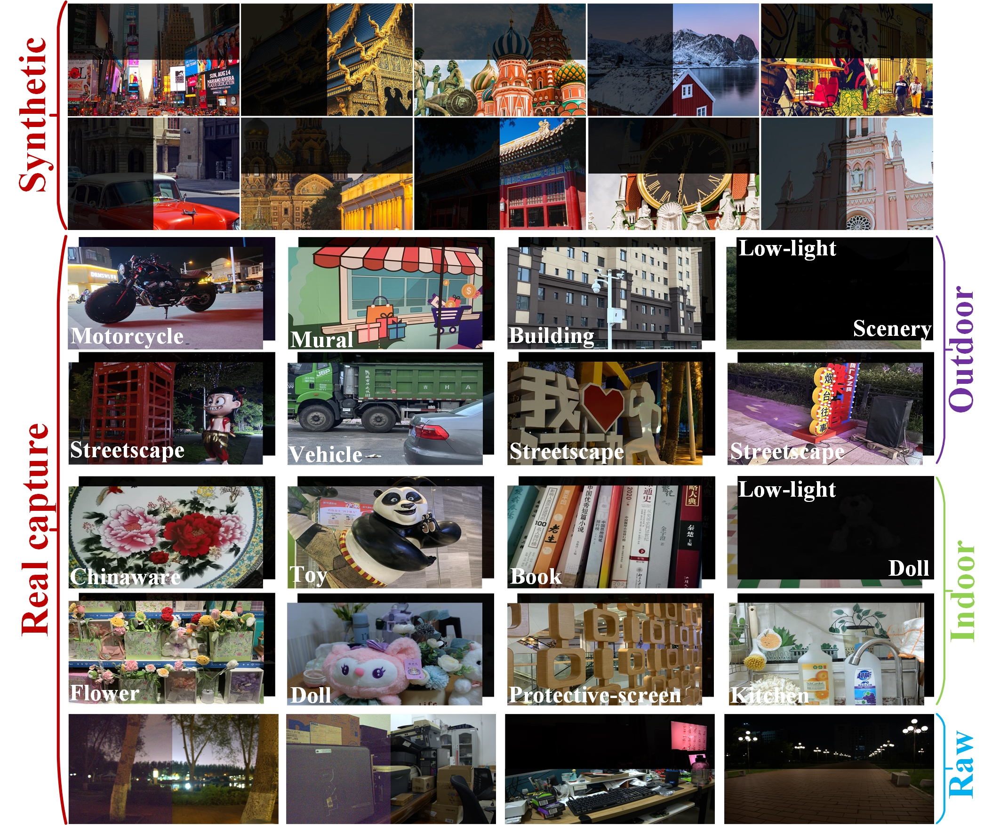
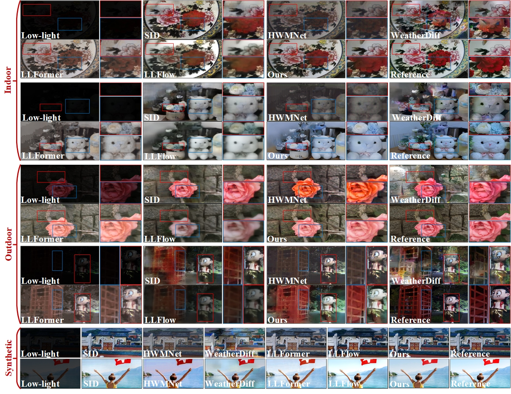

# RNVE
RNVE: A Real Nighttime Vision Enhancement Benchmark and Dual-Stream Fusion Network ([SPL](https://ieeexplore.ieee.org/document/10363369))



-----------------------------------------------------



We release a novel RNVE dataset for low-light image enhancement. 

RNVE can be downloaded in the below link.

The RAW data included in the RNVE dataset: [link](https://pan.baidu.com/s/1A_h9oPJ7r3I5NE6RTagbsw?pwd=1kqh)

The entire RNVE dataset, which has already been split into training and test sets: [link](https://pan.baidu.com/s/180VvEyxCfLuchc-_so4Obg?pwd=kf9t)


## Citation

If you find our work useful, please consider citing our paper:
```
@ARTICLE{10363369,
  author={Wang, Yuehang and Zhang, Yongji and Guo, Qianren and Zhao, Minghao and Jiang, Yu},
  journal={IEEE Signal Processing Letters}, 
  title={RNVE: A Real Nighttime Vision Enhancement Benchmark and Dual-Stream Fusion Network}, 
  year={2024},
  volume={31},
  number={},
  pages={131-135},
  keywords={Pipelines;Training;Semantics;Cameras;Signal processing algorithms;Visualization;Streaming media;Fusion network;image enhancement;low-light;nighttime vision},
  doi={10.1109/LSP.2023.3343972}}
